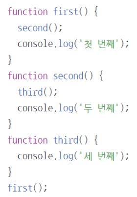
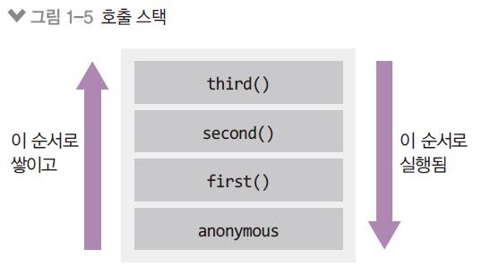

# 2강 자바스크립트
## 호출 스택, 이벤트 루프
### 1. 호출 스택

함수의 호출, 자료구조의 스택
- Anonymous은 가상의 전역 컨텍스트(항상 있다고 생각하는게 좋음)
- 함수 호출 순서대로 쌓이고, 역순으로 실행됨
- 함수 실행이 완료되면 스택에서 빠짐
- LIFO 구조라서 스택이라고 불림
### 2. 이벤트 루프
## ES6(2015)+ 문법
### 1. const, let
### 2. 템플릿 문자열
### 3. 객체 리터럴
### 4. 화살표 함수
### 5. 구조분해 할당
### 6. 클래스
### 7. 프로미스
### 8. async/await
### 9. for await of
### 10. Map/Set
### 11. 널 병합, 옵셔널 체이닝

## 프런트엔드 자바스크립트
### 1. AJAX
### 2. FormData
### 3. encodeURIComponent, decodeURIComponent
### 4. data attribute와 dataset