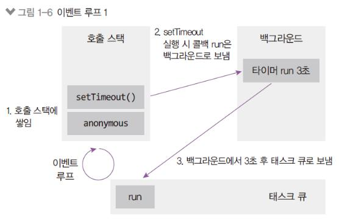
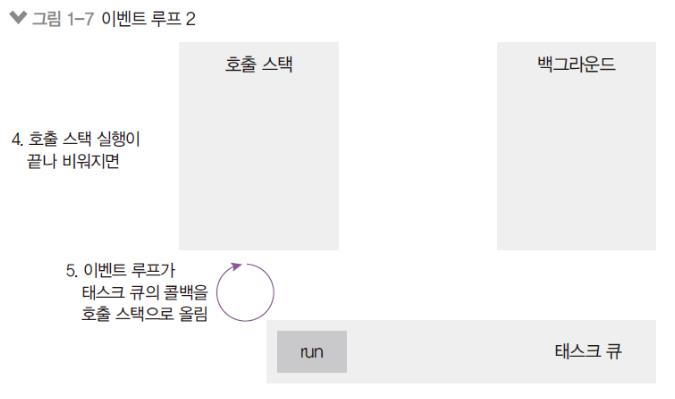
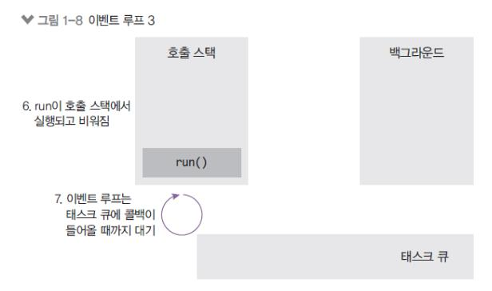

# 2강 자바스크립트
## 호출 스택, 이벤트 루프
### 1. 호출 스택

코드의 작동 순서 third -> second -> first

함수의 호출, 자료구조의 스택
- Anonymous은 가상의 전역 컨텍스트(항상 있다고 생각하는게 좋음)
- 함수 호출 순서대로 쌓이고, 역순으로 실행됨
- 함수 실행이 완료되면 스택에서 빠짐
- LIFO 구조라서 스택이라고 불림
### 2. 이벤트 루프

이벤트루프 구조
- 이벤트 루프: 이벤트 발생시 호출할 콜백 함수들을 관리하고 호출할 순서를 결정하는 역활
- 태스크 큐: 이벤트 발생 후 호출되어야 할 콜백 함수들이 순서대로 기달리는 공간
- 백그라운드: 타이머나I/O작업 콜백, 이벤트 리스너들이 대기하는 공간, 여러 작업이 동시에 실행될 수 있음

예제 코드에서 setTimeout이 호출될 때 콜백 함수 run은 백그라운드로
- 백그라운드에서 3초를 보냄
- 3초가 다 지난 후 백그라운드에서 태스크 큐로 보내짐

setTimeout과 anonymous가 실행 완료된 후 호출 스택이 완전히 비워지면,
이벤트 루프가 태스크 큐의 콜백을 호출 스택으로 올림
- 호출 스택이 비워져야만 올림
- 호출 스택에 함수가 많이 차 있으면 그것들을 처리하느라 3초가 지난 후에도 run 함수가 태스크 큐에서 대기하게 됨 -> 타이머가 정확하지 않을 수 있는 이유

run이 호출 스택에서 실행되고, 완료 후 호출 스택에서 나감
- 이벤트 루프는 태스크 큐에 다음 함수가 들어올 때까지 계속 대기
- 태스크 큐는 실제로 여러 개고, 태스크 큐들과 함수들 간의 순서를 이벤트 루프가 결정함
## ES6(2015)+ 문법
### 1. const, let
### 2. 템플릿 문자열
### 3. 객체 리터럴
### 4. 화살표 함수
### 5. 구조분해 할당
### 6. 클래스
### 7. 프로미스
### 8. async/await
### 9. for await of
### 10. Map/Set
### 11. 널 병합, 옵셔널 체이닝

## 프런트엔드 자바스크립트
### 1. AJAX
### 2. FormData
### 3. encodeURIComponent, decodeURIComponent
### 4. data attribute와 dataset