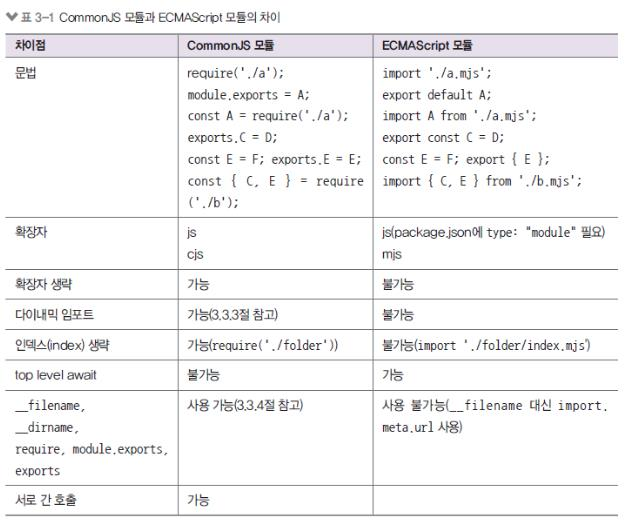

# 3강
## 3.1 REPL 사용하기
자바스크립트는 스크립트 언어라서 즉석에서 코드를 실행할 수 있다.
- REPL 콘솔을 제공
- R(Read), E(Evaluate), P(Print), L(Loop)
- 윈도에서는 명령 프롬프트, 맥이나 리눅스에서는 터미널에 node 입력
## 3.2 JS 파일 실행하기
JS파일을 만들어 출력할 수 있다.
```
function helloWorld(){
  console.log("Hello World!");
  helloWorld();
}
function helloNode(){
  console.log("Hello Node");
}
```
node js파일명 입력으로 해당파일을 실행실킬 수 있다.
## 3.3 모듈로 만들기
노드는 자밧그크립트 코드를 모듈로 만둘 수 있다.
- 모듈: 특정한 기능을 하는 함수나 변수들의 집합
- 모듈로 만들면 여러 프로그램에서 재사용 가능
### 모듈 만들어 보기
코드가 길어지면 찾기 어렵기 때문에 해당 기능의 파일을 만든다.
module.export를 사용해서 해당 변수를 다른 파일에도 사용이 가능하다.
```
const odd = "홀수";
const even = "짝수";

module.exports = { // 모듈시킬 변수를 넣는다.
  odd,
  even,
};
// 사용할려고 하는 파일
const value = require("./var"); // 모듈시킨 변수들을 사용하기 위한 (해당파일)주소
console.log(value); // { odd: '홀수', even: '짝수' } 출력
// 구조분해 할당으로 축약
const {odd, even} = require("./var"); // const odd = value.odd를 축약할 수 있다.
```
#### exports
module.exports도 축약이 가능하다
```
const odd = "홀수";
const even = "짝수";

exports.odd = odd;
exports.even = even;
//module.exports = {odd,even,};
```
두개의 동일하게 동작한다.
```
module.exports === exports === {} //참조 관계이다.
```
하지만 function을 쓸 경우
```
module.exports !== exports === {} // 객체의 속성이 아닌 다른 값을 대입하면 참조 관계가 깨진다.
```
참조가 꺠지는 경우
```
exports.odd = odd;
exports.even = even;
module.exports = {}; // exports와module.exports를 동시에 사용이 불가능하다. module.exports로 새롭게 참조가 된다.
```
한가지를 사용할떄 module.exports를 사용하고 두가지 이상을 쓸떄는 exports를 사용한다.
#### this
```
console.log(this)
```
자바스크립트 에서는 {window}전역객체이고 node에서는 {}가 출력이 된다.
```
function a(){
  console.log(this === global);
}
a(); // true출력
```
#### require
#### ECMAScropt모듈
ECMAScropt모듈(ES모듈)은 공식적인 자바스크립트 모듈 형식이다. CommonJS 모듈을 많이 쓰긴 하지만, ES 모듈이 표준으로 정해지면서 점점 ES 모듈을 사용하는 비율이 늘어나고 있다.
```
// var.mjs
export const odd = "홀수";
export const even = "짝수";
```
```
//func.mjs
import check(num){
  if(num % 2){
    return odd;
  }else {
    return even;
  }
}
export default check;
```
```
//index.mjs
import {odd, even} form './var.mjs';
import checkNum form './func.mjs'; //
function checkString(str){
  if(str.length % 2){
    return odd;
  }else{
    return even;
  }
}
```
requie, exports,module.exports가 각각 import, export, export default 바뀌었다. ES 모듈의 import나 export default는 require나 module처럼 함수나 객체가 아니라 문법 그 자체이다.
파일도 js에서 mjs확장자로 변경이 되었으며 js에서 import를 쓰면 에러가 발생하고 사용을 원할경우 ackage.json에 "type": "module" 속성을 넣으면 된다.



#### 다이내믹 임포트
CommonJS모듈에서는 다이내믹 임포트가 되고 ES모듈에서는 안된다.
```
//dynamic.js
const a = false;
if (a) {
    require('./func');
}
console.log('성공');
```
dynamic.js에서 require('./func')는 실행되지 않는다. if문에 false이기 때문이다. 이렇게 조건부로 모듈을 불러오는 것을 다니내믹임포트라고 한다.
```
//dynamic.mjs
const a = false;
if (a) {
    import './func.mjs';
}
console.log('성공');
```
하지만 ES 모듈은 if문 안에서 import하는 것이 불가능하다.
```
//dynamic.mjs
const a = true;
if (a) {
    const m1 = await import('./func.mjs');
    console.log(m1);
    const m2 = await import('./var.mjs');
    console.log(m2);
}
```
import라는 함수를 사용해서 모듈을 동적으로 불러올 수 있다.
## 3.4 노드 내장 객체 알아보기
## 3.5 노드 내장 모듈 사용하기
## 3.6 파일 시스템 접근하기
## 3.7 이벤트 이해하기
## 3.8 예외 처리하기